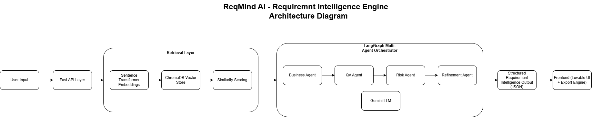

# ReqMind AI – AI Requirement Intelligence Engine

ReqMind AI is an AI-powered backend system that transforms raw stakeholder requirements into structured software requirement documentation using Retrieval-Augmented Generation (RAG) and multi-agent orchestration.

The system analyzes unstructured product ideas and generates:

- Business Objectives
- Functional Requirements
- Non-Functional Requirements
- Assumptions
- Constraints
- Risk & Ambiguity Insights
- Clarification Questions
- Exportable BRD Documentation

---

# Architecture Overview

ReqMind AI uses a multi-agent architecture combined with RAG to generate structured requirement analysis.

Key components:

- **FastAPI Backend** – API layer for requirement analysis
- **LangGraph Agents** – Multi-agent orchestration
- **ChromaDB Vector Store** – Knowledge retrieval
- **Sentence Transformers** – Embedding generation
- **Gemini LLM** – Structured reasoning and output generation

---

# Architecture Diagram

---

# Tech Stack

- Python
- FastAPI
- LangGraph
- Gemini LLM
- ChromaDB
- Sentence Transformers
- Retrieval Augmented Generation (RAG)

---

# Project Structure

reqmind-ai-backend
├ main.py
├ agents_graph.py
├ vector_store.py
├ requirements.txt
├ knowledge_base/
└ docs/
└ architecture.png

---

# Running the Project Locally

Clone the repository

git clone https://github.com/mohiddeenshaik-del/reqmind-ai-backend

Navigate to project folder

cd reqmind-ai-backend

Create virtual environment

python -m venv venv

Activate environment

venv\Scripts\activate

Install dependencies

pip install -r requirements.txt

Run the server

uvicorn main:app --reload

API will run at:

http://127.0.0.1:8000

Swagger docs:

http://127.0.0.1:8000/docs

---

# Example Request

POST /analyze

{
"requirement": "Build a mobile banking app that allows users to transfer funds and check balances."
}

---

# Example Output

{
"business_objective": "...",
"functional_requirements": [...],
"non_functional_requirements": [...],
"assumptions": [...],
"constraints": [...]
}

---

# Future Improvements

- Multi-industry knowledge packs
- PRD generation
- Jira story export
- Stakeholder interview agent
- Requirement gap detection

---

# Author

Khaja Mohiddeen  
AI Systems & Workflow Architect